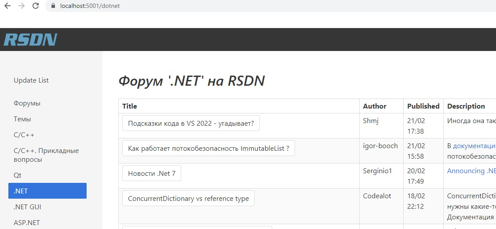

# RsdnRssReader
Минималистичная читалка сводки с форумов сайта rsdn.org
на базе fsbolero.io (оригинальная реализация webassembly с использованием html template - смотри main.html)
и FSharp.Data (xml type provider и html parser)

Чтобы попробовать нужно клонировать репозитарий
и запустить dotnet --porject .\src\RsdnRss.Server
перейти по адресу https://localhost:5001

